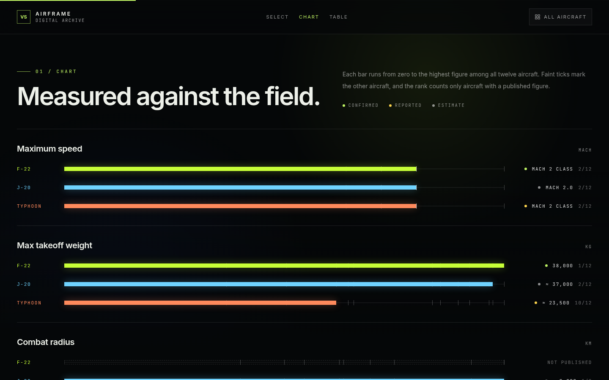
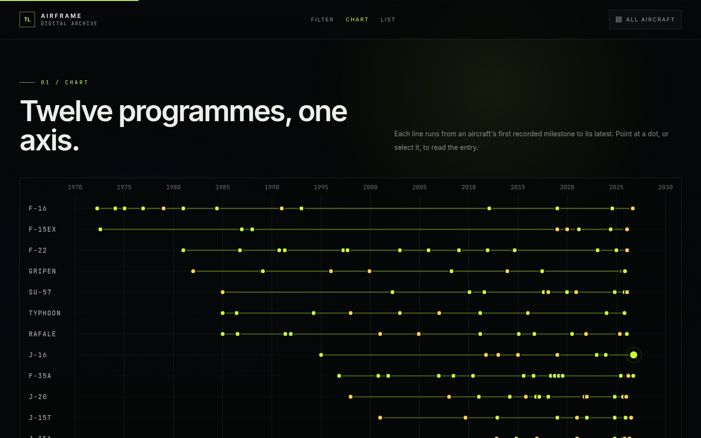

# Airframe — Digital Aircraft Archive

[](https://github.com/SergioRA1/Digital-Airframe-Archive/actions/workflows/deploy.yml)

An interactive digital exhibition of twelve modern combat aircraft, built as a static single-page React site.

**Live site:** https://sergiora1.github.io/Digital-Airframe-Archive/


## What's inside

- **Twelve aircraft files**: J-20, F-22, F-35, Su-57, F-16, Typhoon, Rafale, Gripen, J-35A, J-16, J-15T and F-15EX. Each has design notes, specifications, a programme timeline, variants and a reference section.
- **Confidence labels**: every specification and milestone is marked as confirmed, reported or estimated, so official figures are kept apart from press reporting.
- **Interactive comparison**: pick up to three aircraft and compare speed, weight, combat radius, ceiling and size on animated bar charts, with a sortable table of all twelve. The selection is kept in the address, so a comparison such as `#/compare/f-22,j-20,typhoon` can be shared as a link.
- **Combined timeline**: every milestone from every aircraft on one chart and in one list, filterable by origin and by confidence.
- **Photo galleries**: a gallery for each aircraft and a combined archive. Every photo is freely licensed and credited with its photographer, licence and source.
- **Hangar index**: a home page that lists every aircraft, with search by designation, name, manufacturer or origin.
- **Two hand-built pages**: the J-20 and F-22 pages have custom visuals, such as a radar display and aircraft drawings. The other ten are rendered from data by one shared template.

| Interactive comparison | Combined timeline |
| --- | --- |
|  |  |

## Built with

- [React 18](https://react.dev/) and [Vite 6](https://vite.dev/)
- [Tailwind CSS 3](https://tailwindcss.com/)
- [framer-motion](https://motion.dev/) for animation, which respects the system's reduced-motion setting
- [lucide-react](https://lucide.dev/) icons
- [ESLint](https://eslint.org/) and [Playwright](https://playwright.dev/) for linting and browser tests

Plain JavaScript and JSX, with no backend. Routing is hash-based, and every page except the home page is loaded on demand.

## Running locally

Requires [Node.js](https://nodejs.org/) 22 or later. The deploy pipeline uses Node 24.

```bash
npm install       # install dependencies
npm run dev       # start the dev server
npm run build     # production build into dist/
npm run preview   # serve the production build
npm run lint      # check the code with ESLint
npm test          # run the browser tests
```

## Tests

[Playwright](https://playwright.dev/) tests in `tests/` run against the production build in Google Chrome. They open every page and gallery and fail on any console error, and they check the menu, search, shareable comparison links, table sorting and timeline filters.

## Project structure

```
src/
  App.jsx           routes and page registry
  Home.jsx          hangar index
  J20.jsx, F22.jsx  hand-built aircraft pages
  AircraftPage.jsx  shared template for data-driven pages
  pages/<slug>.js   content for each data-driven aircraft
  aircraft.js       master list of aircraft
  Sections.jsx      shared sections: specifications, timeline, comparison, reference
  Compare.jsx       interactive comparison
  Chronology.jsx    combined timeline
  figures.js        numeric figures used by the comparison charts
  Layout.jsx        header, footer and page chrome
  Gallery.jsx       galleries and the combined archive
  photos.js         photo URLs and credits
  usage.js          capabilities and use for each aircraft
```

To add an aircraft, create a data module in `src/pages/` and register it in the shared files. The full checklist is in [`CLAUDE.md`](CLAUDE.md).

## Deployment

Every push to `main` lints the code, runs the tests, builds the site and publishes it to GitHub Pages. A failing check stops the deploy, so a broken build never reaches the live site. This runs through [`.github/workflows/deploy.yml`](.github/workflows/deploy.yml).

## Content and photos

Figures are drawn from open sources such as manufacturer and government publications and press reporting. Much about several of these aircraft is not officially published, so treat the figures as approximate. The site is for educational purposes.

Photographs are hotlinked from Wikimedia Commons under their own licences: public domain, CC0, CC BY, CC BY-SA or the UK Open Government Licence. Each photo is credited on the site. The photos are not covered by this repository.
